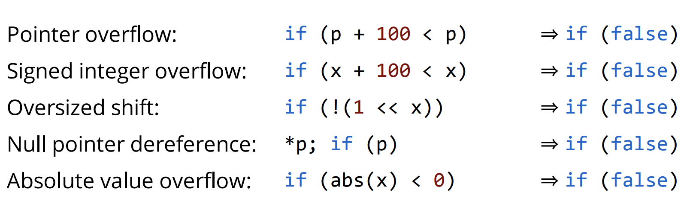

# 问题
最近在写代码的时候，碰到一个神奇的现象。
具体而言，我们的系统有一个 seek 的语义，根据 POSIX 的语义要求，在文件 offset 计算过程中发生 overflow 的时候需要返回 EOVERFLOW。
完成该 seek 逻辑后，写了 test case 测试相关 overflow 的逻辑。
该 overflow test case，在 Linux 用 GCC 编译， Debug 和 Release 编译都可以通过；但是在 MacOS 上用 clang 编译，Debug 可以通过，Release 不可以通过。

简化后的代码基本逻辑如下：

（说明：为了方便理解主要意思，简化了 seek 实现，同时在函数的每个关键地方都加上了log）

```c++
#include <errno.h>
#include <fcntl.h>
#include <stdio.h>

// to show the sign overflow undefined behavior, we simplify the seek logic.
long long sim_seek(long long offset, int whence) {
  printf("%s: input for seek, g_pos: %lld offset: %lld whence: %d\n", __func__,
         g_pos, offset, whence);

  long long old_pos = g_pos;
  long long new_pos = -1;

  switch (whence) {
    case SEEK_SET: {
      new_pos = offset;
      break;
    }
    case SEEK_CUR: {
      new_pos = old_pos + offset;
      if (offset > 0 && new_pos < old_pos) {
        printf(
            "%s: overflow by adding, "
            "(offset(%lld) + old_pos)=new_pos(%lld) < old_pos(%lld)\n",
            __func__, offset, new_pos, old_pos);
        return -EOVERFLOW;
      }

      break;
    }
    case SEEK_END:  // omit the logic for SEEK_END
    default:
      return -EINVAL;
  }

  if (new_pos < 0) {
    printf("%s: new_pos(%lld) is negative\n", __func__, new_pos);
    return -EINVAL;
  }

  g_pos = new_pos;
  printf("%s: end of lseek, g_pos: %lld \n", __func__, g_pos);
  return g_pos;
}
```

测试逻辑，如下：

```c++
#include <errno.h>
#include <fcntl.h>
#include <limits.h>
#include <stdio.h>

long long sim_seek(long long offset, int whence);

// main function emulates the test case below:
// TEST(Simulate, SimLseekWithOverflow) {
//   off_t ret = sim_seek(LONG_MAX, SEEK_SET);
//   ASSERT_EQ(ret, LONG_MAX);
//   ret = sim_seek(1, SEEK_CUR);
//   ASSERT_EQ(ret, -EOVERFLOW);
// }
int main() {
  printf("%s: try to seek to LLONG_MAX(%lld)\n", __func__, LLONG_MAX);
  long long ret = sim_seek(LLONG_MAX, SEEK_SET);
  if (ret != LLONG_MAX) {
    printf("%s: fail to sim_lseek to LLONG_MAX\n", __func__);
    return -1;
  }

  printf("\n");

  printf(
      "%s: try to seek to LLONG_MAX + 1 (which will trigger signed overflow)\n",
      __func__);
  ret = sim_seek(1, SEEK_CUR);

  printf("\n");
  if (ret != -EOVERFLOW) {
    printf("%s: oops!!!! sim_lseek not overflow, ret: %lld\n", __func__, ret);
    return -1;
  } else {
    printf("%s: sim_lseek overflow\n", __func__);
  }
  return 0;
}
```

Debug 编译和 Release 编译主要差别为优化选项是否使用 O3 编译。

说明：整个过程其实和 OS 平台关系不大，为了操作方便（objdump 比 otool 体验要好一点），后续命令都在 linux 平台上完成。

clang 版本：
```
% g++ --version
clang version 15.0.7 (Red Hat 15.0.7-2.el9)
Target: aarch64-redhat-linux-gnu
Thread model: posix
InstalledDir: /usr/bin
```

```bash
# emulate compilation under debug mode.
% g++ -g -O0 main.cc sim_seek.cc -o overflow-under-O0

# run the debug version
% ./overflow-under-O0
main: try to seek to LLONG_MAX(9223372036854775807)
sim_seek: input for seek, g_pos: 0 offset: 9223372036854775807 whence: 0
sim_seek: end of lseek, g_pos: 9223372036854775807

main: try to seek to LLONG_MAX + 1 (which will trigger signed overflow)
sim_seek: input for seek, g_pos: 9223372036854775807 offset: 1 whence: 1
sim_seek: overflow by adding, (offset(1) + old_pos)=new_pos(-9223372036854775808) < old_pos(9223372036854775807)

main: sim_lseek overflow
# seek catches the overflow behavior


# emulate compilation under release mode.
% g++ -g -O3 main.cc sim_seek.cc -o overflow-under-O3

# run the release version
% ./overflow-under-O3
main: try to seek to LLONG_MAX(9223372036854775807)
sim_seek: input for seek, g_pos: 0 offset: 9223372036854775807 whence: 0
sim_seek: end of lseek, g_pos: 9223372036854775807

main: try to seek to LLONG_MAX + 1 (which will trigger signed overflow)
sim_seek: input for seek, g_pos: 9223372036854775807 offset: 1 whence: 1
sim_seek: new_pos(-9223372036854775808) is negative

main: oops!!!! sim_lseek not overflow, ret: -22
# lseek misses the overflow behavior
```

通过上面的日志输出，我们可以发现 release 模式下 （O3编译） ，其实没有执行如下代码逻辑。

```c++
      if (offset > 0 && new_pos < old_pos) {
        printf(
            "%s: overflow by adding, "
            "(offset(%lld) + old_pos)=new_pos(%lld) < old_pos(%lld)\n",
            __func__, offset, new_pos, old_pos);
        return -EOVERFLOW;
      }
```

通过观察汇编代码，-O3 编译下，确实也没有生成相关逻辑。
（在 linux 平台上通过 objdump 获得）


```
...
    case SEEK_CUR: {
      new_pos = old_pos + offset;
  400838:       8b130113        add     x19, x8, x19
    case SEEK_END:  // omit the logic for SEEK_END
    default:
      return -EINVAL;
  }
...
```

# 为什么呢？
最后通过网上材料，才发现是代码触发 signed-integer-overflow，而 signed-integer-overflow 在c/c++ 语言中被定义为 undefined behaviour, 而 clang 对于这个 undefined behavior 会认为程序员自己会处理好了这种情况，最终它会假设这种情况不会发生，进而基于这个假设去优化代码（例如不生产前面的判断逻辑）。

除了 sign-integer-overflow 这种 undefined behavior 之外 ，还有其他的几类 undefined behaviors, 如下图:


llvm 大佬 Chris Lattner 有一篇博文说明了这个情况，读完大家可能有有直观感觉, 详细见 [链接](https://blog.llvm.org/2011/05/what-every-c-programmer-should-know.html)。

看到这个问题，想起 MIT PDOS 团队之前研究内核中 interger overflow 的论文（该论文因为发现 linux 等软件中许多 bug 和安全漏洞，获得了当年的最佳论文），对这个现象有详细描述，有兴趣的同学，可以结合着论文一起看看，附上论文 [链接](https://dl.acm.org/doi/10.1145/2517349.2522728)。

# 怎么解决这个问题
- 参考 linux kernel 中 seek 做法，不判断 overflow 情况，直接判断 new_pos 存在小于 0，如果小于0，直接返回 -EINVAL。

- 开启 -signed-integer-overflow 来编译代码

开启 signed-integer-overflow 来编译代码的话，如果运行时发生 overflow，系统会直接退出。需要开发者根据自己的情况来选择。

```bash
% g++ -g -fsanitize=signed-integer-overflow -O3 main.cc sim_seek.cc -o overflow-under-O3check

% ./overflow-under-O3check
main: try to seek to LLONG_MAX(9223372036854775807)
sim_seek: input for seek, g_pos: 0 offset: 9223372036854775807 whence: 0
sim_seek: end of lseek, g_pos: 9223372036854775807

main: try to seek to LLONG_MAX + 1 (which will trigger signed overflow)
sim_seek: input for seek, g_pos: 9223372036854775807 offset: 1 whence: 1
sim_seek.cc:22:25: runtime error: signed integer overflow: 9223372036854775807 + 1 cannot be represented in type 'long long'
SUMMARY: UndefinedBehaviorSanitizer: undefined-behavior sim_seek.cc:22:25 in
sim_seek: overflow by adding, (offset(1) + old_pos)=new_pos(-9223372036854775808) < old_pos(9223372036854775807)

main: sim_lseek overflow
```

# 其他问题
在 debug 过程中，曾经把 `sim_seek` 和 `main` 编译到一个文件，运行效果如下：

```bash
$ g++ -g -O3 main_seek.cc -o combine-under-O3

$ ./combine-under-O3
main: try to seek to LLONG_MAX(9223372036854775807)
sim_seek: input for seek, g_pos: 0 offset: 9223372036854775807 whence: 0
sim_seek: end of lseek, g_pos: 9223372036854775807

main: try to seek to LLONG_MAX + 1 (which will trigger signed overflow)
sim_seek: input for seek, g_pos: 9223372036854775807 offset: 1 whence: 1
sim_seek: end of lseek, g_pos: -9223372036854775808

main: oops!!!! sim_lseek not overflow, ret: -9223372036854775808
```

程序在执行的时候并没有走到如下判断里面的逻辑。

```c++
  if (new_pos < 0) {
    printf("%s: new_pos(%lld) is negative\n", __func__, new_pos);
    return -EINVAL;
  }
```
但是反汇编 clang 生成的 binary 是有生成上面的代码逻辑:

```c++
  if (new_pos < 0) {
  400754:       b7f80253        tbnz    x19, #63, 40079c <_Z8sim_seekxi+0x98>
    printf("%s: new_pos(%lld) is negative\n", __func__, new_pos);
    return -EINVAL;
  }
```
有兴趣的同学可以用 gdb 或者 lldb 跟踪下到底发生了什么。

# 附录
- STACK 论文：https://dl.acm.org/doi/10.1145/2517349.2522728
- https://blog.llvm.org/2011/05/what-every-c-programmer-should-know.html